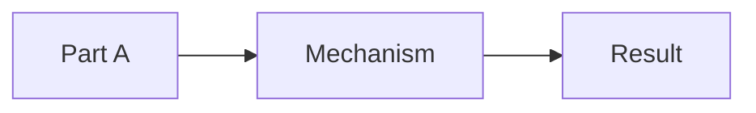

# Article Patterns

Use the smallest pattern that makes the concept clear. Mix patterns only when the topic needs it.

## Pattern Selection

| Topic shape | Use this pattern | Best visual |
|---|---|---|
| System, process, architecture | Mechanism-first | `flowchart` |
| Two concepts often confused | Contrast-first | paired `graph` or comparison table |
| Abstract theory | Concrete-to-abstract | example flow + concept map |
| Historical/event explanation | Cause chain | `flowchart` or `timeline` when supported |
| Human decision or protocol | Interaction trace | `sequenceDiagram` |
| Common false belief | Misconception repair | wrong-model vs better-model diagram |
| Lifecycle or modes | State model | `stateDiagram-v2` |

## Default Structure

```markdown
# <Clear Title>

<!-- explain-article:audience -->
## Who This Is For

<!-- explain-article:core-claim -->
## The Core Idea

<!-- explain-article:map -->
## The Map



<!-- explain-article:mechanism -->
## How It Works

<!-- explain-article:depth-probes -->
## One Level Deeper

<!-- explain-article:example -->
## A Concrete Example

<!-- explain-article:boundary -->
## What People Misunderstand

<!-- explain-article:check -->
## Check Your Understanding

<!-- explain-article:sources -->
## Sources
```

## Mermaid Rules

- Use default Mermaid syntax and style.
- Do not add custom theme, config, hand-drawn look, or CSS unless requested.
- Keep node text short enough to scan.
- Prefer left-to-right diagrams for pipelines and top-down diagrams for decomposition.
- Each diagram must make one relationship clearer than prose alone.
- Introduce each diagram with one sentence that tells the reader what to look for.
- Explain the takeaway after the diagram.

## Revision Moves

If the draft feels boring:

- Add a mechanism diagram before adding more prose.
- Replace a generic example with a specific case.
- Add a contrast: "same input, changed condition, different result."
- Turn a paragraph of categories into a table.
- Add a prediction question before revealing the answer.

If the draft feels shallow:

- Add the constraint or tradeoff that forced the design.
- Explain what would break without the mechanism.
- Include a false model and repair it.
- Add a `depth-probes` section with at least three explicit probes: mechanism chain, constraint/tradeoff, counterfactual, model comparison, or source-backed detail.
- Add a boundary where the explanation no longer applies.

If the draft feels too dense:

- Split one section into two.
- Move terminology after the first example.
- Delete source details that do not change the reader's model.
- Replace a list of parts with a concept map.
